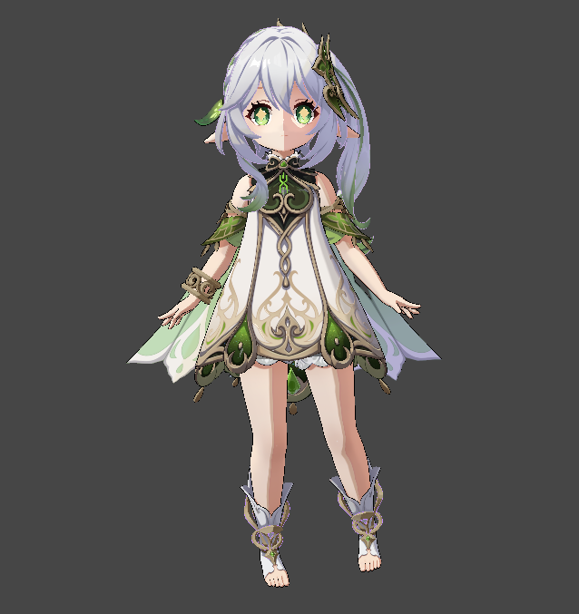
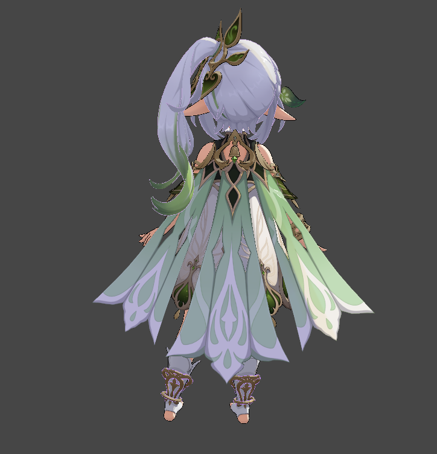

# Nahida Render Project (NahidaProjectfrombilibili)

这是一个基于 Unity Universal Render Pipeline (URP) 的高级渲染项目，核心特色在于实现了一套 **PBR (基于物理的渲染) 与 NPR (非实感渲染/卡通渲染) 深度混合** 的方案。

## 技术亮点：PBR + NPR 混合渲染架构

本项目不只是简单的卡通着色，而是在 `NahidaBase.shader` 中构建了一套混合动力系统：

- **基于物理的物理高光 (PBR Specular)**:
  - 完整实现了标准的 **BRDF 高光模型**（包含 GGX 法线分布函数、Smith 几何遮蔽函数以及 Fresnel 菲涅尔反射）。
  - 通过 `_ILM` 贴图的通道控制，将物理精确的高光反射与卡通色块有机融合，特别是在金属材质（Metal/Gold）的处理上，兼具卡通的简洁与金属的真实质感。
- **多级 Ramp 卡通阴影 (Multi-Row Ramp NPR)**:
  - 利用 `_ILM` 贴图的 Alpha 通道作为材质 ID，实现了 5 级以上的多行 Ramp 纹理采样。
  - 支持 **日夜循环采样切换**（Day/Night Ramp），根据光源方向（L.y）自动过渡光照色调。
- **ILM 纹理驱动系统**:
  - **G 通道**: 控制亮暗面硬度与范围。
  - **B 通道**: 作为 Specular Mask，精细控制 PBR 高光和传统高光的强度。
  - **R 通道**: 用于判定金属度 (Metallic) 及材质属性。
- **高级面部处理**: 专用的 `NahidaFace.shader` 配合 SDF 阴影，确保面部在任何角度下都有完美的卡通阴影轮廓。

## 核心功能

- **自定义 URP 后期处理**: 扩展了 `PostProcessFeature`，提供针对卡通渲染优化的 Bloom 和色彩校正效果。
- **顶点偏移描边 (Outline)**: 经典的背面剔除 + 法线平滑偏移算法，保证线条粗细均匀。
- **运行时材质更新**: 脚本 `MaterialUpdater.cs` 实时同步角色的朝向与光源方向，确保 NPR 阴影的逻辑正确性。

## 项目结构

- **Assets/Shaders**:
  - `NahidaBase.shader`: **核心文件**，包含 PBR+NPR 混合实现的渲染 Pass。
  - `GenshinToon/`: 包含卡通渲染的基础库和核心计算公式。
- **Assets/Scripts/Rendering**: URP 管线扩展与后期处理逻辑实现。
- **Assets/Materials**: 预设材质，展示了如何通过 `ILM` 通道配置不同部分的物理属性。

## 快速开始

1. **Unity 版本**: 2022.3 (LTS) 及以上。
2. **管线设置**: 确保 `Graphics Settings` 启用了项目自带的 URP Asset。
3. **查看效果**: 打开 `Assets/Scenes/` 目录下的展示场景。

## 参考与致谢

本项目在实现过程中学习并借鉴了以下项目：
- [UnityGenshinToonShader](https://github.com/kaze-mio/UnityGenshinToonShader)
- [UnityGenshinPostProcessing](https://github.com/kaze-mio/UnityGenshinPostProcessing)
---

